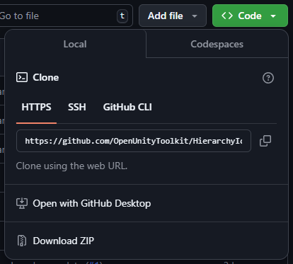

# Hierarchy Icons
Replaces the standard cubes in the Scene Hierarchy with more informative icons.

## Features
- Icons are sourced from:
    - The Game Object scene assigned icon 
    - The first component with an icon on a Game Object
    - Folders icons for Game Objects with children objects but no components
    - A representative mesh icons based on vertex count
    - Light icons with indicative colouring
- Prefab Game Objects with changes are flagged with overlays
- Vertex count for meshes are displayed
- Tree lines are shown to help make sense the object hierarchy
- Features can be toggled in preferences

## Preferences
The plugin can be configured in Preferences Open Toolkit > Hierarchy Icons

## Setting Icons
You can set an icon for your own components by selecting the script in the project browser and setting an icon

You can similarly set an icon for Game Objects in a scene or prefab

You can use any texture in your project as an icon, but it should be square, 32x32 or larger and uncompressed.

## Compatibility
Minimum version Unity 2019.4
Tested with Unity 2019.4, 2020.3, 2021.1, and Unity 6

Currently compatible with dark mode

## Installing
Copy the git URL from GitHub

Open `Window > Package Manager` and select `+ > Add page from git URL...`

Paste the URL and click `Add`

